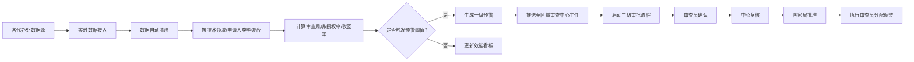

## 1. 产品概述

全国性知识产权申请与审查效能智能分析平台，旨在通过实时接入各代办处的专利申请、审查、授权及年费数据，利用智能分析技术提升知识产权审查效率，为国家、省、代办处三级管理人员提供数据驱动的决策支持。

- **核心目标**：实现审查效能的可视化监控、智能预警、资源优化配置和自动化报告生成
- **目标用户**：国家知识产权局管理人员、省级审查中心主任、代办处审查员及行政人员
- **市场价值**：大幅提升专利审查效率，缩短审查周期，优化人力资源配置，提高审查质量一致性

## 2. 核心功能

### 2.1 用户角色与权限

| 角色 | 层级 | 核心权限 |
|------|------|----------|
| 国家局管理员 | 国家级 | 查看全国数据、审批最终调整、系统配置、生成全国报告 |
| 省级中心主任 | 省级 | 查看所辖省份数据、接收一级预警、复核审查员调整方案、生成本省报告 |
| 代办处主任 | 代办处级 | 查看本代办处数据、确认预警信息、申请审查员调整 |
| 审查员 | 代办处级 | 处理审批任务、查看个人工作数据、录入审查意见 |

### 2.2 功能模块

1. **登录认证模块**：三级权限登录、角色权限控制、会话管理
2. **数据接入与清洗模块**：实时数据接入、自动清洗、按技术领域/申请人类型聚合
3. **效能看板模块**：全国热力图、授权率排名、省份下钻、趋势曲线、驳回原因分布
4. **智能预警模块**：审查周期超期预警、授权率下滑预警、预警推送与处理
5. **三级审批流程模块**：审查员确认→中心复核→国家局批准的审查员分配调整流程
6. **人员预测模块**：Excel工作计划导入、历史数据分析、未来6个月缺口预测、招聘/借调方案推荐
7. **诊断报告模块**：周报自动生成、同比环比分析、流程优化建议
8. **系统管理模块**：用户管理、代办处配置、指标阈值设置

### 2.3 页面详情

| 页面名称 | 模块名称 | 功能描述 |
|----------|----------|----------|
| 登录页 | 身份认证 | 用户名密码登录、角色选择、验证码、记住登录 |
| 总览看板 | 全国概览 | KPI卡片（申请总量、平均审查周期、授权率、驳回率）、全国审查效率热力图、技术领域授权率排名、实时预警列表 |
| 省份详情页 | 省份下钻 | 省份筛选、代办处列表、近7天审查趋势曲线、驳回原因饼图/柱状图、技术领域分布 |
| 预警中心 | 预警管理 | 预警列表（一级/二级/三级）、预警详情、预警处理、历史预警查询 |
| 审批中心 | 审批流程 | 待审批列表、审批详情、三级审批操作（确认/复核/批准）、审批历史追溯 |
| 人员预测 | 资源规划 | Excel上传、目标审查量提取、缺口预测图表、招聘/借调方案对比推荐 |
| 诊断报告 | 报告中心 | 周报列表、报告详情查看、报告导出、历史报告对比 |
| 系统管理 | 配置管理 | 用户管理、代办处管理、阈值配置、数据同步监控 |

## 3. 核心流程

### 3.1 数据处理与预警流程

系统实时从各代办处接入专利申请数据，经过自动清洗和聚合处理后，计算关键指标。当某技术领域连续3个月审查周期超目标30%或授权率连续下滑20%时，自动触发一级预警并推送至区域审查中心主任，同时启动三级审批流程调整审查员分配。

### 3.2 人员预测流程

用户上传年度专利工作计划Excel后，系统自动提取目标审查量，结合历史数据趋势预测未来6个月审查员缺口，并推荐最优招聘或借调方案供决策参考。

## 4. 用户界面设计

### 4.1 设计风格

- **主色调**：深蓝色系 (#0B2545) 代表权威和专业，搭配科技蓝 (#13315C) 和亮蓝 (#1B4965) 作为辅助色
- **强调色**：预警红 (#C1272D)、成功绿 (#2E7D32)、警告橙 (#F57C00)、信息蓝 (#1565C0)
- **背景色**：浅灰 (#F5F7FA) 主背景，白色 (#FFFFFF) 卡片背景
- **字体**：主字体使用思源黑体/Noto Sans SC，标题字号 24-32px，正文 14-16px，数据展示使用等宽字体
- **按钮风格**：圆角 6px，实心按钮带微阴影，悬停时有轻微上浮效果
- **布局风格**：顶部导航 + 左侧菜单 + 内容区域的经典管理后台布局，卡片式数据展示
- **图标风格**：线性图标为主，使用 Lucide 图标库，保持简洁统一

### 4.2 页面设计概览

| 页面名称 | 模块名称 | UI 元素 |
|----------|----------|---------|
| 登录页 | 身份认证 | 渐变背景、中央卡片式登录框、品牌Logo、输入框带图标、登录按钮动效 |
| 总览看板 | 全国概览 | 顶部KPI卡片（4列带图标）、中国地图热力图（SVG+交互）、右侧排名列表和预警列表、图表带悬停提示 |
| 省份详情页 | 省份下钻 | 面包屑导航、省份选择器、趋势折线图（多系列）、驳回原因环形图、代办处数据表格 |
| 预警中心 | 预警管理 | 状态标签页（待处理/处理中/已处理）、预警卡片带严重等级标识、时间线处理记录 |
| 审批中心 | 审批流程 | 审批流时间线可视化、三级节点状态标识、审批意见输入区、操作按钮组 |
| 人员预测 | 资源规划 | 文件拖拽上传区、数据解析进度条、缺口预测面积图、方案对比卡片 |
| 诊断报告 | 报告中心 | 报告卡片网格、报告内页富文本+图表、导出下拉菜单 |
| 系统管理 | 配置管理 | Tab切换布局、数据表格带操作列、模态框表单编辑 |

### 4.3 响应式设计

- **桌面优先**设计，以 1440px 宽度为基准
- 平板端（768-1024px）：左侧菜单可折叠，热力图自适应缩放
- 移动端（<768px）：顶部导航简化，卡片单列布局，图表转为可滚动视图

### 4.4 交互动效

- 页面加载：卡片错落淡入动画（staggered fade-in）
- 数据更新：KPI数值滚动变化动画
- 图表交互：鼠标悬停显示详情气泡，省份热力图点击高亮下钻
- 按钮交互：悬停微上浮+阴影加深，点击涟漪效果
- 预警推送：右上角通知滑入动画，带警示音效提示（可选）
