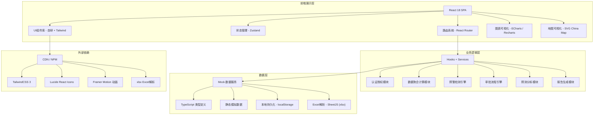
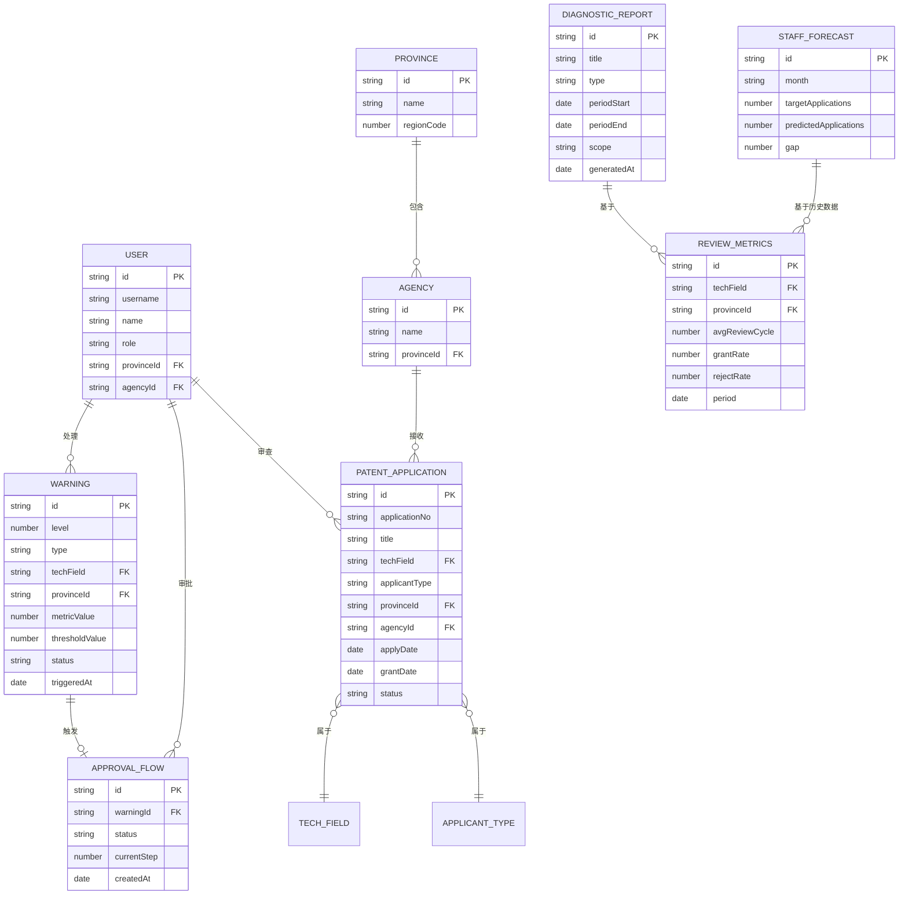

## 1. 架构设计



## 2. 技术说明

- **前端框架**：React 18.2 + TypeScript 5.0
- **构建工具**：Vite 5.0
- **样式方案**：TailwindCSS 3.4 + PostCSS + Autoprefixer
- **路由管理**：React Router DOM 6.20
- **状态管理**：Zustand 4.4（轻量级状态管理）
- **图表可视化**：ECharts 5.4（热力图、趋势图、饼图等专业图表）
- **图标库**：Lucide React（线性风格，简洁专业）
- **动画库**：Framer Motion（页面过渡、交互动效）
- **Excel解析**：SheetJS (xlsx)（解析年度工作计划Excel）
- **数据方案**：纯前端 Mock 数据 + localStorage 持久化（无需后端服务）
- **代码规范**：ESLint + Prettier

## 3. 路由定义

| 路由路径 | 页面名称 | 权限要求 | 说明 |
|----------|----------|----------|------|
| /login | 登录页 | 公开 | 用户身份认证 |
| /dashboard | 总览看板 | 所有登录用户 | 全国数据概览、热力图、排名、预警 |
| /province/:provinceId | 省份详情页 | 省级及以上 | 省份下钻、代办处数据、趋势曲线 |
| /warnings | 预警中心 | 代办处主任及以上 | 预警列表、预警处理、历史查询 |
| /approvals | 审批中心 | 所有登录用户 | 待审批列表、三级审批操作 |
| /forecast | 人员预测 | 省级及以上 | Excel上传、缺口预测、方案推荐 |
| /reports | 诊断报告 | 所有登录用户 | 周报列表、报告查看、导出 |
| /settings | 系统管理 | 国家局管理员 | 用户、代办处、阈值配置 |

## 4. 模块数据结构（TypeScript 类型）

```typescript
// 用户与权限
interface User {
  id: string;
  username: string;
  name: string;
  role: 'national' | 'provincial' | 'agency' | 'examiner';
  provinceId?: string;
  agencyId?: string;
  permissions: string[];
}

// 专利申请数据
interface PatentApplication {
  id: string;
  applicationNo: string;
  title: string;
  techField: TechField;
  applicantType: ApplicantType;
  provinceId: string;
  agencyId: string;
  applyDate: Date;
  firstOfficeActionDate?: Date;
  grantDate?: Date;
  rejectDate?: Date;
  status: 'pending' | 'examining' | 'granted' | 'rejected';
  annualFeePaid: boolean;
}

// 审查指标
interface ReviewMetrics {
  techField: string;
  provinceId: string;
  totalApplications: number;
  avgReviewCycle: number; // 天
  grantRate: number; // 0-1
  rejectRate: number; // 0-1
  period: 'day' | 'week' | 'month';
  date: Date;
}

// 预警
interface Warning {
  id: string;
  level: 1 | 2 | 3;
  type: 'cycle_exceed' | 'grant_rate_drop';
  techField: string;
  provinceId?: string;
  metricValue: number;
  thresholdValue: number;
  triggeredAt: Date;
  status: 'pending' | 'processing' | 'resolved';
  message: string;
  approvalFlowId?: string;
}

// 审批流程
interface ApprovalFlow {
  id: string;
  warningId: string;
  title: string;
  type: 'examiner_reallocation';
  status: 'step1_pending' | 'step2_pending' | 'step3_pending' | 'approved' | 'rejected';
  currentStep: 1 | 2 | 3;
  step1Approval?: ApprovalRecord;
  step2Approval?: ApprovalRecord;
  step3Approval?: ApprovalRecord;
  proposal: ReallocationProposal;
  createdAt: Date;
}

interface ApprovalRecord {
  userId: string;
  userName: string;
  approved: boolean;
  comment: string;
  approvedAt: Date;
}

// 人员预测
interface StaffForecast {
  month: string;
  targetApplications: number;
  predictedApplications: number;
  currentCapacity: number;
  gap: number;
  recommendedHire?: number;
  recommendedBorrow?: number;
}

// 诊断报告
interface DiagnosticReport {
  id: string;
  title: string;
  type: 'weekly';
  period: { start: Date; end: Date };
  scope: 'national' | 'provincial' | 'agency';
  scopeId?: string;
  content: ReportContent;
  generatedAt: Date;
}

interface ReportContent {
  cycleYoY: number;
  cycleMoM: number;
  grantRateChange: number;
  rejectRateDistribution: Record<string, number>;
  optimizationSuggestions: string[];
}

// 技术领域枚举
type TechField = 'ai' | 'biotechnology' | 'electronics' | 'machinery' | 'materials' | 'software' | 'telecom' | 'other';
type ApplicantType = 'enterprise' | 'university' | 'research' | 'individual' | 'government';
```

## 5. 项目目录结构

```
src/
├── assets/              # 静态资源（图片、字体等）
├── components/          # 可复用UI组件
│   ├── charts/         # 图表组件
│   ├── layout/         # 布局组件（Header、Sidebar、Footer）
│   ├── ui/             # 基础UI组件（Button、Card、Modal、Table等）
│   └── common/         # 通用业务组件（KPI卡片、预警项等）
├── data/               # Mock数据
│   ├── china-map.ts    # 中国地图SVG数据
│   ├── applications.ts # 专利申请模拟数据
│   ├── warnings.ts     # 预警模拟数据
│   ├── approvals.ts    # 审批流模拟数据
│   └── users.ts        # 用户模拟数据
├── hooks/              # 自定义Hooks
│   ├── useAuth.ts      # 认证Hook
│   ├── useMetrics.ts   # 指标计算Hook
│   └── useWarnings.ts  # 预警检测Hook
├── layouts/            # 页面布局
│   └── MainLayout.tsx  # 主布局
├── pages/              # 页面组件
│   ├── Login.tsx
│   ├── Dashboard.tsx
│   ├── ProvinceDetail.tsx
│   ├── WarningCenter.tsx
│   ├── ApprovalCenter.tsx
│   ├── StaffForecast.tsx
│   ├── Reports.tsx
│   └── Settings.tsx
├── router/             # 路由配置
│   └── index.tsx
├── store/              # 状态管理
│   ├── authStore.ts
│   ├── warningStore.ts
│   └── approvalStore.ts
├── types/              # TypeScript类型定义
│   └── index.ts
├── utils/              # 工具函数
│   ├── formatters.ts   # 数据格式化
│   ├── calculations.ts # 指标计算
│   └── permissions.ts  # 权限控制
├── App.tsx
├── main.tsx
└── index.css
```

## 6. 数据模型关系图


